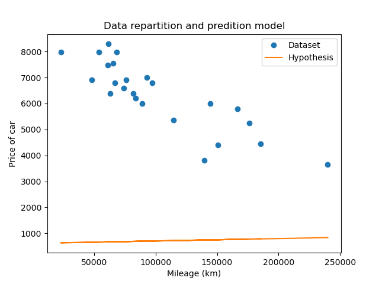

# Linear Regression

This project is about making *Linear Regression* using *Gradient Descent* on a fake dataset.

<p align="center">
  
</p>

## Usage

```
$ python train.py --help
usage: train.py [-h] [--alpha ALPHA] [--max_iter MAX_ITER] [--show]

Train model with linear regression

optional arguments:
  -h, --help           show this help message and exit
  --alpha ALPHA        define learning rate (default: 0.1)
  --max_iter MAX_ITER  define number of iterations (default: 1000)
  --show               display plots during gradient descent
```

(How I made the gradient descent gif: [gif with matplotlib](https://towardsdatascience.com/basics-of-gifs-with-pythons-matplotlib-54dd544b6f30))
